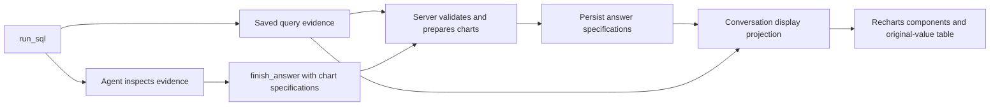

# Charts in analytical answers

## Decision and ownership

The agent submits chart specifications inside `finish_answer`. Specifications
reference saved evidence and column names. They contain no values, SQL, rendering
code, or Recharts options. SQL owns analytical transformations; the server owns
validation and extraction; the browser owns presentation.

This uses the existing terminal tool and evidence workflow. A separate chart tool
would consume another model turn without adding needed capability. Copying result
values through the model would introduce transcription risk and token overhead.
Rerunning SQL for display could change a previously accepted answer.



Shared chart contracts contain runtime schemas, limits and types independent of
Recharts and infrastructure. The server chart module takes specifications,
referenced evidence IDs and an explicit evidence lookup. It performs no I/O and
does not depend on conversation persistence types. Its preparation function is
reused for terminal validation and display projection.

The analysis service controls which evidence is visible, including historical
evidence actually supplied to the model. `finish_answer` checks references and
prepares charts before terminal acceptance. Query evidence is durably checkpointed
before it becomes visible. Existing deadlines, attempt budgets, cancellation and
terminal commit behavior apply to chart repairs as well.

The conversation display projection looks up only evidence owned by the current
conversation. It adds `renderedCharts` to browser attempts. The repository stores
the original answer specifications, not resolved chart rows. Routes remain thin;
GET, duplicate submissions and SSE all use the same snapshot projection.

The UI chart feature contains Recharts components, coordinate mapping, formatting,
tooltips, an accessible data table and a chart rendering boundary. Chat components
only position these display components within an answer.

## Specification and display contracts

New `finish_answer` calls require a `charts` array. Use `[]` when no chart helps.
Stored `Answer.charts` is optional so historical answers remain readable without
rewriting saved JSON. Prompt/tool versions are `analyst-v9` and `analysis-tools-v7`.

Checkout overviews use ordered session stages: Started checkout, Added shipping
details, Added payment details, Recorded purchase. Step-to-step rates use ordinary
bars with transitions as category rows in journey order. Period comparisons use
periods as series. Captions identify progression versus observed non-progression
and each preceding-stage denominator; recorded details do not imply shipment or
confirmed payment, and missing progression does not establish abandonment.
The catalog supplies stage/transition SQL shapes with numeric ordering and
SAFE_DIVIDE for undefined rates. These are model guidance, not semantic runtime
validation; saved charts retain their original wording.
No database schema migration is required for charts.

Each specification has `type`, `evidenceId`, `title`, `caption` and the relevant
column mappings. Its evidence ID must also appear in the answer's `evidenceIds`.
One chart uses one result. SQL must combine or reshape data before charting it.

```json
{
  "type": "line",
  "evidenceId": "00000000-0000-4000-8000-000000000001",
  "title": "Daily revenue",
  "caption": "Revenue in USD during December 2020; missing observations appear as gaps.",
  "x": { "column": "date", "label": "Date" },
  "series": [
    {
      "column": "revenue",
      "label": "Revenue",
      "format": { "kind": "currency", "currency": "USD" }
    }
  ]
}
```

| Type | Mappings | Required result shape |
| --- | --- | --- |
| `line` | `x`, `series` | Unique, chronologically ordered DATE or timezone-qualified TIMESTAMP x values |
| `bar` | `x`, `series` | Unique nonempty categories; one row per category |
| `stacked_bar` | `x`, `series` | Category grain with nonnegative values and matching formats |
| `scatter` | Numeric `x`, numeric `y`, optional `pointLabelColumn` | Complete numeric coordinates; duplicate x values allowed |
| `histogram` | `lowerBoundColumn`, `upperBoundColumn`, `xLabel`, `count` | Ordered contiguous equal-width bins with nonnegative integer counts |
| `funnel` | `stage`, `count` | Unique stages in intended order; nonnegative integer counts that never increase |

Category mappings have `column` and `label`. Value mappings additionally have
`format`. Count mappings use `{ "kind": "number" }`. Supported formats are:

- `{ "kind": "number" }`
- `{ "kind": "currency", "currency": "USD" }` (three uppercase letters)
- `{ "kind": "percentage", "inputScale": "ratio" }` for fractional ratios
- `{ "kind": "percentage", "inputScale": "percent" }` for percentage-point values

All series sharing one axis must have matching formats. Scatter axes can differ.
Column existence, unique scalar metadata, values and result shape are checked
against actual evidence. These checks do not prove SQL's analytical correctness,
currency identity, funnel population definitions, or the truth of a caption;
the existing evidence-review instructions still apply.

A ready display entry is `{ kind: "ready", spec, rows }`. Rows include only selected
columns, retain source order and pairing, and preserve exact values and nulls.
The payload excludes SQL, job metadata and unrelated result columns. Resolved
data is never stored in outcomes or included in model context; future context
replays specifications and the existing query evidence.

## Limits, readability and precision

- At most three charts per answer, five series per chart and 200 source rows.
- Category charts allow 20 categories; funnels eight stages; histograms 40 bins.
- Category labels fit 120 characters. The UI wraps them rather than dropping text.
- Combined resolved chart data and specifications fit 64 KiB of UTF-8 JSON.
- Reject empty, entirely missing or service-truncated results. SQL top-N results
  are permitted when the title or caption explicitly identifies that subset.

Limits reject the requested chart with recoverable feedback. No layer silently
truncates rows, selects a prefix, merges categories or downsamples values.
The agent can request stronger SQL aggregation, a disclosed top-N subset, fewer
series, wider bins, or finish a supported textual answer.

Category charts use horizontal bars, wrapped labels and height derived from label
and series counts. Line charts use a numeric time scale, so uneven time intervals
are represented correctly. Numeric axes use compact ticks; tooltips retain full
units and original decimal strings. Funnel stages are also listed in order with
counts, so long labels remain readable. Animations are disabled.

Plots have a minimum width of 420 pixels. Narrow screens can scroll within the
chart rather than squeezing labels or expanding the page. The plot and data-table
scroll regions are keyboard-accessible, with a hint when the plot overflows. Each figure has a title and descriptive
caption, and a native “View data” disclosure exposes every selected original
value. Series have names and legends; line series also use different dash patterns.

Exact decimal and integer strings remain unchanged in display payloads, tooltips
and data tables. Recharts coordinates use approximate JavaScript numbers.
Reject nonfinite values, unsafe integer magnitudes and nonzero values that
underflow to zero. Exact-string Intl formatting avoids monetary rounding errors
from early Number conversion. Original strings remain available even when a
formatted monetary label rounds to the currency's display precision.

Null cells are preserved in line and category charts and shown as “Missing” in
tables/tooltips. Lines do not connect across explicit null observations. Absent
dates are not synthesized; SQL must supply null rows when showing gaps requires
a complete calendar. Scatter coordinates, histogram bins and funnel counts
must be complete. Missing values are never converted to zero.

## Selection, failures and compatibility

The prompt asks for a chart only when its pattern supports a specific conclusion:
trends, category comparisons, distributions, relationships, composition or stage
progression. Scalar answers, simple lookups and conceptual guidance usually stay
textual. Explicit user preferences to include or omit charts take precedence.
Captions identify relevant periods, units, denominators, missing data and subsets.
Association is not causation; charting does not grant stronger evidence.

Invalid charts produce deterministic recoverable `invalid_chart` or `chart_limit`
tool errors with a chart index. No terminal outcome is accepted until preparation
succeeds. The agent may repair within existing budgets or finish with `charts: []`.

If projection of a previously saved answer fails, retain the narrative and return
unavailable-chart entries for that answer. Report a category and run ID through
the existing diagnostic boundary, without rows, SQL or raw exceptions. A UI
rendering failure is contained within the plot, preserving its caption and data
table. Reload never reruns queries. Historical answers without charts remain
unchanged; old protocol replay does not need new tool arguments.

## Verification

Tests cover all six chart types, exact extraction, missing cells, source ownership
and visibility, rejected mappings/shapes, truncation, units and limits. Workflow
tests verify validation before acceptance, text repair, SQLite reopening, GET/SSE
parity, duplicate submissions, safe display projection and follow-up context
without resolved rows. UI tests cover exact formatting, concise axis ticks,
wrapped labels, accessible data tables, untrusted text and failure presentation.

Run `npm test`, `npm run lint`, `npm run typecheck` and `npm run build`. Browser
verification should exercise all six chart types at desktop and narrow widths,
tooltips, original-value tables and containment of horizontal scrolling.
