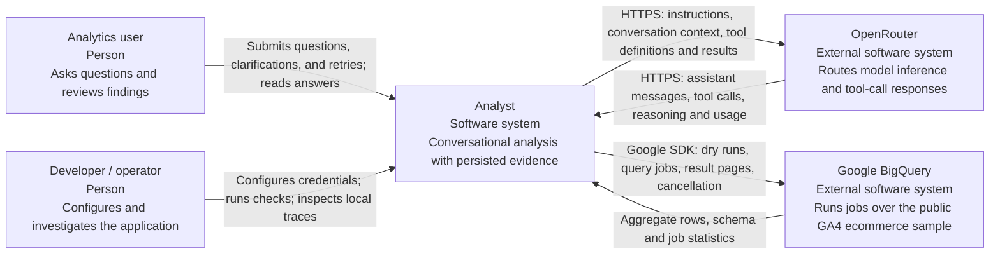

# C4 level 1: system context

## System and relationships

The user and operator are roles, not implemented accounts. The application has no authentication or per-user authorization. Conversation UUIDs identify records; they do not establish ownership by a person. The current application is intended for a trusted local assessment environment.

## Responsibilities

| Element | Responsibility and boundary |
| --- | --- |
| Analyst | Owns submission admission, durable history, analytical tools, budgets, evidence validation, and safe browser presentation. |
| OpenRouter | Supplies inference through its chat-completions API. The application validates responses and executes tools itself; OpenRouter does not access SQLite or invoke the BigQuery SDK. |
| Google BigQuery | Hosts the sample source data and executes read-only analytical jobs. The configured Google Cloud project owns query execution and billing; `bigquery-public-data.ga4_obfuscated_sample_ecommerce` owns the source tables. |
| Developer / operator | Supplies a model ID, API key, query project, Google Application Default Credentials, and SQLite path; uses diagnostic scripts and the development debugger. |

## Information crossing boundaries

The server sends reconstructed user questions, assistant history, provider replay data, and selected complete evidence payloads to OpenRouter. Evidence payloads can contain SQL, result rows, semantic guidance, declared scope, and assumptions. This is a real external data transfer, distinct from the smaller browser projection.

BigQuery receives validated SQL over the allowed sample tables. The application neither imports the warehouse into SQLite nor copies the whole dataset into browser storage. SQLite persists bounded query evidence and conversation execution records on the application host.

Normal chat responses exclude raw SQL, provider reasoning, tool-call transcripts, and raw query payloads. Accepted chart projections include only selected columns and values. The local debugger is a separate inspection surface with access to raw persisted records and traces.

## Source references

[Application composition](../../src/server/config/conversations.ts), [OpenRouter transport](../../src/server/adapters/openrouter/transport.ts), [BigQuery composition](../../src/server/config/data-layer.ts), [SQL policy](../../src/server/data/sql-policy.ts), [browser projection](../../src/server/conversations/display.ts), and [debug trace reader](../../src/server/debug/agent-traces.ts).
