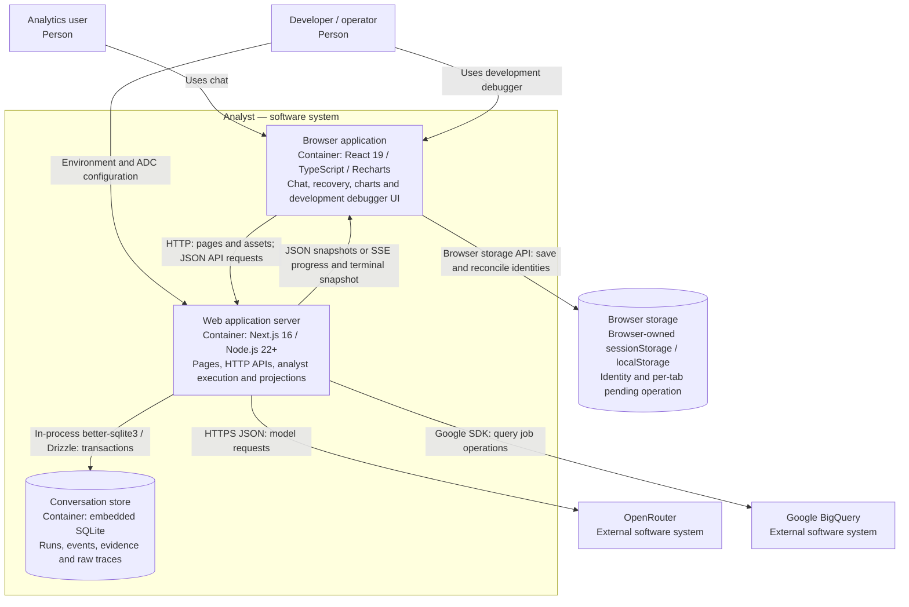

# C4 level 2: containers

## Execution and storage boundaries

The Next.js server serves the minimal page shell and browser assets as well as Node-only API routes. Analytical execution runs in the request-owning server process. There is no queue, separate worker, or durable execution scheduler. A new streaming POST owns its repository connection until execution and stream cleanup settle; ordinary JSON requests open and close their own application instance.

SQLite runs through a native driver inside Node. Its file, WAL, and SHM artifacts live on the host filesystem. Browser storage retains the active conversation pointer and a pending submission record, not authoritative conversation history. `sessionStorage` holds tab identity and pending operations; `localStorage` provides a last-conversation fallback for another tab.

## HTTP interface

| Endpoint | Response and responsibility |
| --- | --- |
| `POST /api/conversations` | `201` JSON conversation snapshot; creates a conversation. |
| `GET /api/conversations/{id}` | JSON snapshot; reconciles expired runs before loading history. |
| `POST /api/conversations/{id}/messages` | New submission: SSE. Existing matching submission: `202` JSON while running, otherwise `200` JSON. |
| `POST /api/conversations/{id}/runs/{runId}/retry` | Same transport behavior; creates another attempt for the original user message. |
| `GET /api/debug/agents` | Local, non-production run listing. |
| `GET /api/debug/agents/{runId}` | Local, non-production raw events, evidence, and traces. |

Message submission carries `message`, a stable UUID `clientMessageId`, and `expectedRevision`. Retry carries the latter two fields, with the target run in the URL. Revisions have the form `v1:<runCount>:<lastEventSequence>`. JSON and SSE payloads are runtime-validated using shared Zod contracts. Conflicts return `409`; invalid input returns `400`; missing records return `404`; unavailable dependencies/storage and synchronization failures use safe application error responses.

SSE events are `accepted`, coarse `progress` (`thinking` or `querying`), and terminal `answer`, `clarification`, or `error`. Answers are not streamed token by token. Conversation responses disable caching; the stream also disables proxy buffering through `X-Accel-Buffering`.

## Trust boundaries

Secrets, cloud SDK access, provider replay data, and persistence remain in server modules. Shared modules are browser-safe schemas and types. The debugger page is disabled in production; debugger API handlers additionally check the request URL's loopback hostname. These checks are development restrictions, not an authentication system.

## Source references

[Page shell](../../src/app/page.tsx), [HTTP/SSE lifecycle](../../src/server/conversations/http.ts), [shared contracts](../../src/shared/conversations.ts), [browser storage](../../src/features/chat/storage.ts), [SQLite adapter](../../src/server/adapters/persistence/repository.ts), and [debug API](../../src/app/api/debug/agents/route.ts).
