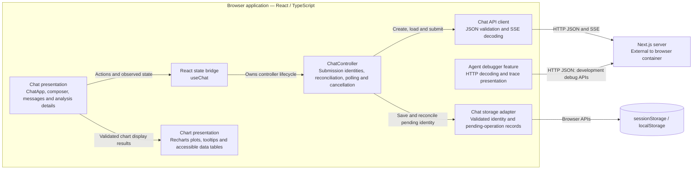
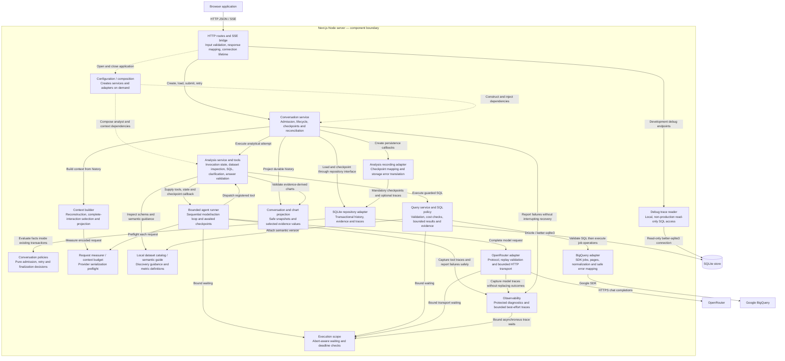

# C4 level 3: components

## Browser application

Rendering components display state and invoke actions. `useChat` bridges React lifecycle to the controller. `ChatController` receives API and storage dependencies explicitly, rejects older snapshots, and owns one tab's request state. A generation identifies the conversation lifecycle; a monotonically increasing submission identity also protects cleanup after awaited synchronization, including when a newer submission starts in the same conversation. It saves recovery information before issuing a POST. The pure snapshot reconciliation module decides whether pending work is accepted, still in flight, stale, or recoverable; the controller applies storage and state changes and never automatically resends uncertain work. Chart rendering consumes prepared display data; it does not query BigQuery or resolve evidence itself.

Sources: [chat controller](../../src/features/chat/controller.ts), [snapshot reconciliation](../../src/features/chat/snapshot-reconciliation.ts), [React bridge](../../src/features/chat/useChat.ts), [API decoder](../../src/features/chat/chat-api.ts), [storage adapter](../../src/features/chat/storage.ts), [chart presentation](../../src/features/charts/AnswerChart.tsx), and [debugger view](../../src/app/debug/agents/view.tsx).

## Server application

The chart-validation arrow represents the server chart subsystem: tool acceptance uses `prepareAnswerCharts`, while snapshot display uses `projectAnswerCharts`. These are separate operations sharing preparation logic.

## Ownership and data flow

| Component group | Owns | Does not own |
| --- | --- | --- |
| Routes and HTTP bridge | Parsing route/body inputs, HTTP mapping, SSE emission, abort propagation, closing repository connections | Admission rules or analytical decisions |
| Conversation service | Duplicate lookup, preparation, run admission, historical context request, persistence callbacks, failure finalization, durable snapshot resolution | Vendor protocol or SQL execution |
| Context | Validate event/run/evidence ownership and call/result pairing; omit incomplete failed interactions; replay complete evidence and outcomes; measure capacity | Browser display or database writes |
| Analysis | Four registered tools, shared query budget, visible evidence, diagnostic-answer validation and chart acceptance | Agent iteration or SQLite details |
| Agent runner | Model allowance, sequential dispatch, tool availability, corrective feedback, checkpoint ordering and terminal commit semantics | SQL semantics or interpretation of evidence artifacts |
| Data service | Allowed SQL, dry-run scan ceiling, billed-byte cap, pagination, result budget and typed evidence | Conversation persistence or automatic retries |
| Adapters | Provider serialization/replay, Google SDK calls/normalization, SQLite transactions | Application workflow policy |
| Display | Safe error text, accepted outcomes, evidence-selected chart values and fallback for unavailable charts | Model replay or raw debugger traces |

`inspect_dataset` reads a versioned local catalog without calling BigQuery. `run_sql` executes through the query service. `request_clarification` and `finish_answer` are terminal actions. Data answers require visible evidence and evidence-backed findings. Diagnostic answers cannot finish with an investigable necessary question while continuation and SQL budgets remain, unless a specific obstacle is declared. Truncated evidence requires a partial answer and limitations.

Context selection retains complete interactions; no automatic compaction or summarization exists. Original reasoning and argument strings are preserved for provider-compatible replay. A failed active interaction or incompatible replay produces a typed error rather than silently dropping history. Evidence becomes visible to subsequent analytical actions only after an awaited checkpoint succeeds.

Conversation [policies](../../src/server/conversations/policies.ts) are pure decisions over transaction-owned snapshots. The [analysis recording adapter](../../src/server/conversations/analysis-recording.ts) maps checkpoints and translates storage errors; [composition](../../src/server/config/agent-preflight.ts) translates context errors, including overflow used by SQL-tool feedback. The runner imports neither conversation nor context modules. [Observability](../../src/server/observability/reporting.ts) bounds trace waits and isolates reporting failures; it does not weaken mandatory checkpoint durability.

The debugger's [shared envelopes](../../src/shared/agent-debug.ts) validate identities, timestamps and record shapes. Its [HTTP client](../../src/features/debug/debug-api.ts) decodes those contracts, while [presentation components](../../src/features/debug/AgentDebugView.tsx) inspect arbitrary payloads. This is separate from normal conversation display and retains malformed JSON inspection markers.

## Source references

[Composition](../../src/server/config/conversations.ts), [conversation service](../../src/server/conversations/service.ts), [context builder](../../src/server/context/builder.ts), [analysis tools](../../src/server/analysis/tools.ts), [answer validation](../../src/server/analysis/answer-validation.ts), [agent runner](../../src/server/agent/runner.ts), [query service](../../src/server/data/query-service.ts), and [chart projection](../../src/server/charts/display.ts).
