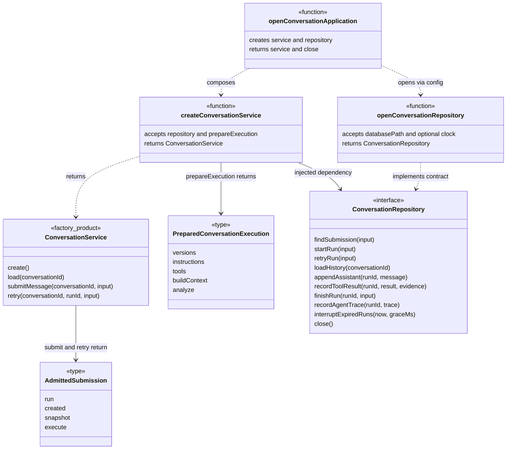
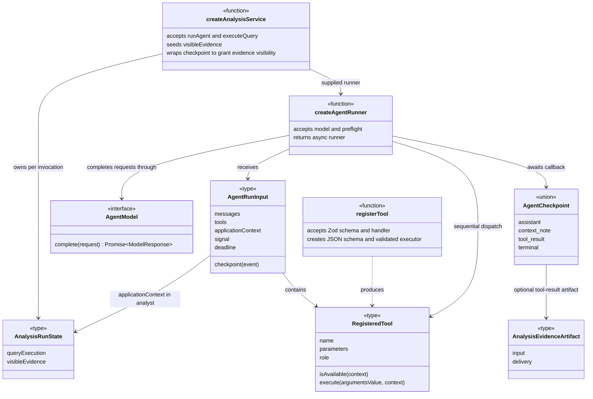
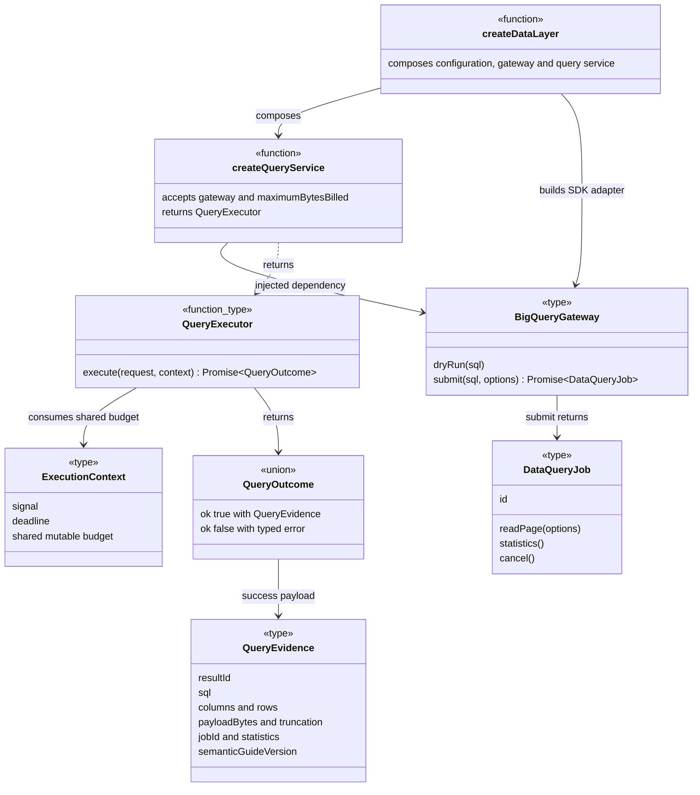

# C4 level 4: selected code relationships

These views describe the implemented collaboration contracts, not an object-oriented rewrite. Mermaid class boxes marked `function`, `type`, or `factory_product` represent those code constructs. Method lists are selected rather than exhaustive; generic parameters are abbreviated in diagrams and defined in the linked source.

## Conversation orchestration

The HTTP bridge consumes `AdmittedSubmission`. Only a newly created run has an executor. A duplicate returns the existing snapshot without rerunning analysis. `ConversationRepository` is the application boundary; `openConversationRepository` supplies a SQLite-backed implementation. Services receive clocks and collaborators explicitly where supported; mutable analytical state belongs to one invocation.

The service supplies persistence hooks through `createAnalysisRecording`. The SQLite implementation evaluates admission and finalization through pure conversation policies inside its existing transactions. `AgentRunnerError.origin` carries safe provenance translated by those recording hooks and by `createAgentPreflight`; the generic runner does not inspect storage or context error classes.

Sources: [composition](../../src/server/config/conversations.ts), [service and admission types](../../src/server/conversations/service.ts), [repository interface](../../src/server/conversations/repository.ts), and [SQLite implementation](../../src/server/adapters/persistence/repository.ts).

## Agent and tool boundary

`RegisteredTool` validates unknown arguments near the boundary. Execution returns a discriminated union: continuing content, recoverable error, or terminal acknowledgment and outcome. The generic runner forwards artifacts without understanding their domain. The analysis service grants evidence visibility after persistence; the conversation service maps checkpoints to repository writes.

Model/tool trace callbacks accept an `AbortSignal`. Trace capture is best-effort and bounded to 100 ms or remaining execution time, with late failures consumed. Successful tool traces follow their mandatory checkpoint; terminal acceptance does not depend on a trace write.

Sources: [model and tool contracts](../../src/server/agent/contracts.ts), [runner input/checkpoint contracts](../../src/server/agent/runner-contracts.ts), [tool registration](../../src/server/agent/tool-registration.ts), [analysis state](../../src/server/analysis/types.ts), and [analysis service](../../src/server/analysis/service.ts).

## Guarded query boundary

`QueryExecutor` accepts `{ sql: unknown }`: TypeScript does not substitute for runtime SQL validation. Deadline units are absolute Unix milliseconds; byte budgets count UTF-8 JSON for columns and rows. `BigQueryGateway` and `DataQueryJob` hide SDK types. The query service returns evidence but performs no persistence; the tool-result checkpoint owns storage.

Sources: [data composition](../../src/server/config/data-layer.ts), [data contracts](../../src/server/data/types.ts), [query service](../../src/server/data/query-service.ts), and [BigQuery gateway](../../src/server/adapters/bigquery/gateway.ts).
