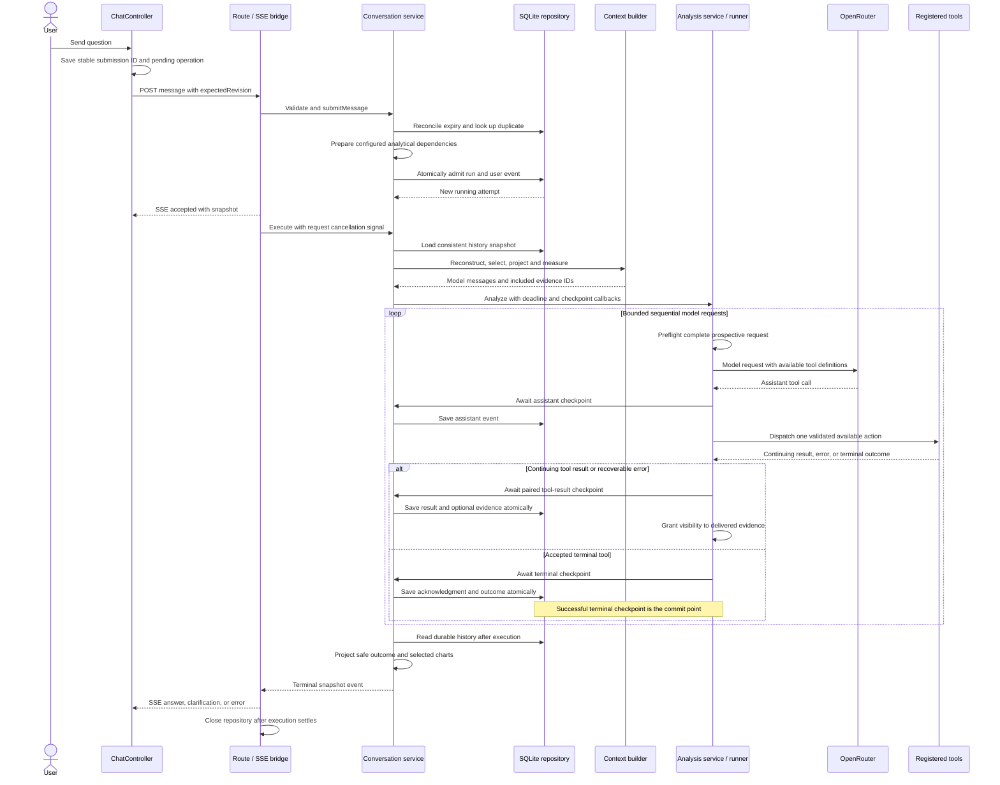
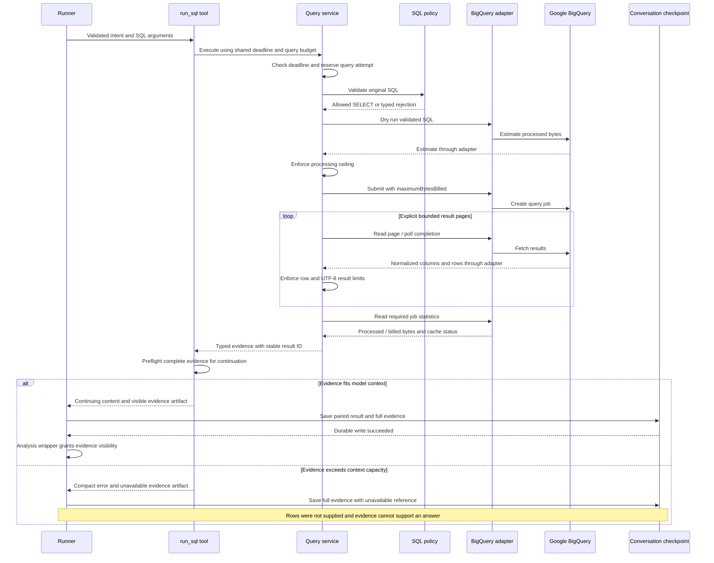
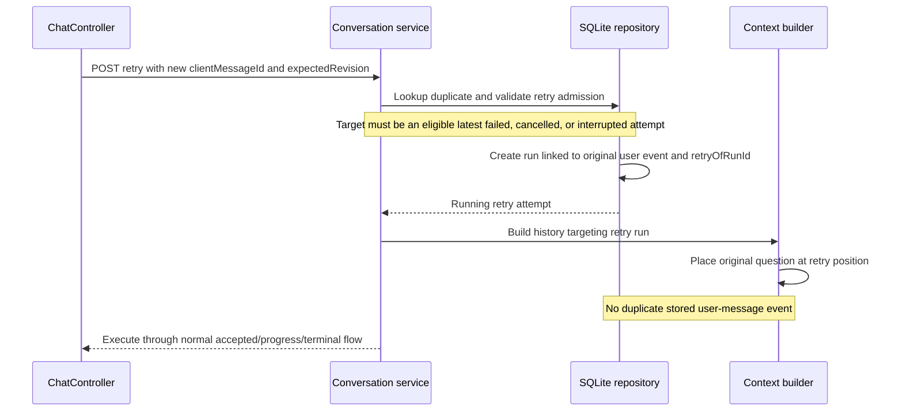
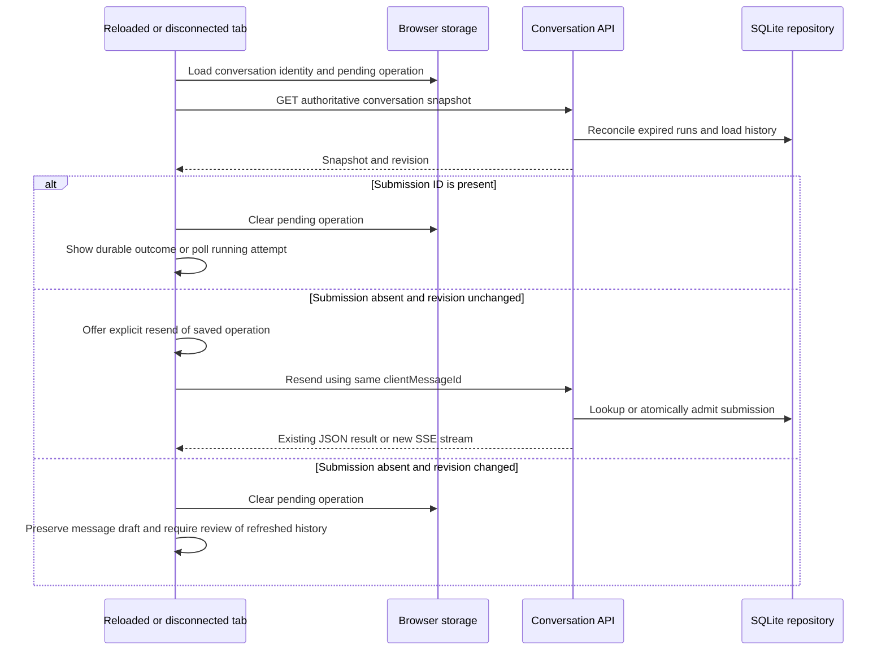
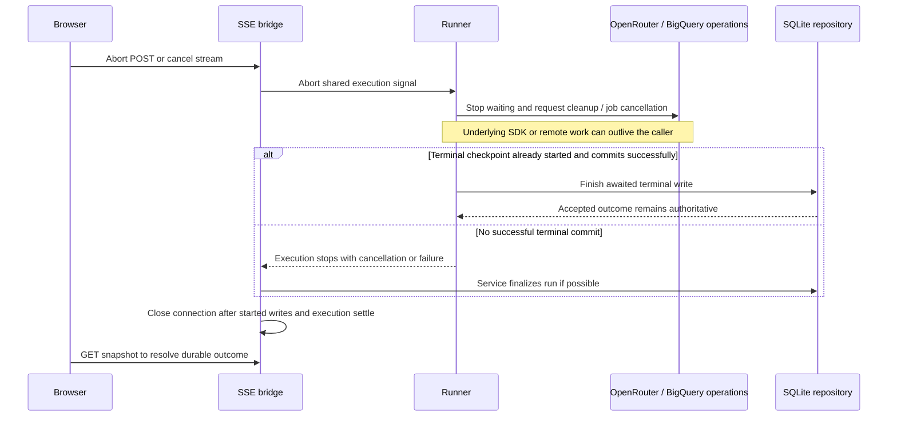
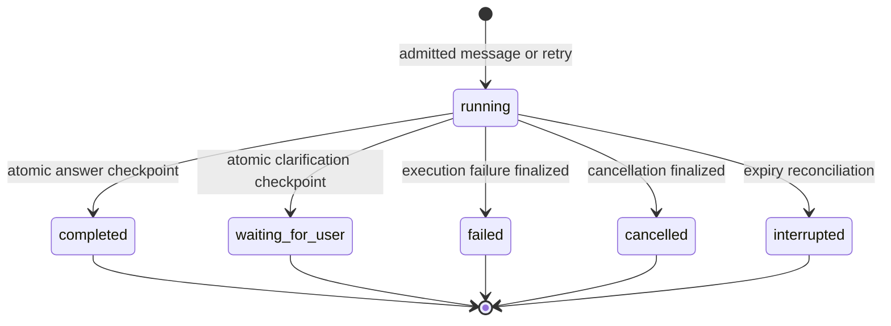

# Runtime flows

## Message to accepted answer

The loop ends on a terminal checkpoint or failure; it does not keep requesting the model after acceptance. The default allowance is six model calls, with terminal actions only on the last call. Text-only model replies are not accepted final answers: the runner persists a corrective context note and requests a tool action while capacity remains. Unexpected call batches execute nothing and receive paired corrective results. Deterministic failed arguments remain suppressed; other failures can become eligible after a successful continuing checkpoint.

Model trace capture occurs before the model adapter returns; successful tool trace capture occurs after its checkpoint. Both are best-effort waits of at most 100 ms or remaining execution time. Failed capture cannot replace the primary outcome; a terminal commit remains successful if subsequent capture reaches the deadline. Cancelled or expired capture is skipped, late rejections are consumed, and callbacks receive a signal that forbids later repository access after cancellation. Diagnostic reporters are isolated from finalization and chart fallback.

## Guarded SQL and evidence delivery

Any policy, cost, result-size, or execution failure exits with a typed result rather than continuing the successful sequence. Rejected SQL consumes an attempt. Oversized schemas or individual rows fail; omitted rows produce explicit truncation metadata. Cost controls apply to warehouse scans independently of returned row counts. BigQuery failures request best-effort cancellation, including a job that arrives after the caller stopped waiting.

## Clarification and retry

`request_clarification` atomically saves its acknowledgment and outcome, yielding `waiting_for_user`. The user's clarification reply is a new message and run with current revision, not a resumption of the completed runner invocation.

An explicit retry uses a new submission identity. Repeating delivery of the same retry request uses the original identity and returns its existing attempt.

## Reconnect and duplicate reconciliation

Recovery does not automatically resend an uncertain request. Matching duplicates are recognized before creating another execution. Reuse of an ID for different content/operation is a submission mismatch; unseen revisions and active-run conflicts are rejected. Older snapshots do not replace newer controller state.

## Cancellation and expiry

An abort cannot make a started checkpoint optional. Terminal persistence success wins over cancellation/deadline expiry during that write. If a process exits before finalization, a later load or admission reconciles runs past their deadline plus a five-second grace period to `interrupted`. This is request-triggered reconciliation, not a background timer or job scheduler. Polling reads durable state and does not resume abandoned work. Arbitrarily stalled persistence callbacks are outside the runner's time bound.

## Run-state view

Terminal states do not transition back to `running`; replies and retries create new runs. Readback of durable state resolves races between terminal acceptance, failure finalization, and expiry reconciliation.

## Source references

[Conversation workflow](../../src/server/conversations/service.ts), [HTTP ownership](../../src/server/conversations/http.ts), [controller recovery](../../src/features/chat/controller.ts), [runner checkpoints](../../src/server/agent/runner.ts), [analysis tools](../../src/server/analysis/tools.ts), [query execution](../../src/server/data/query-service.ts), and [repository transactions](../../src/server/adapters/persistence/repository.ts).
