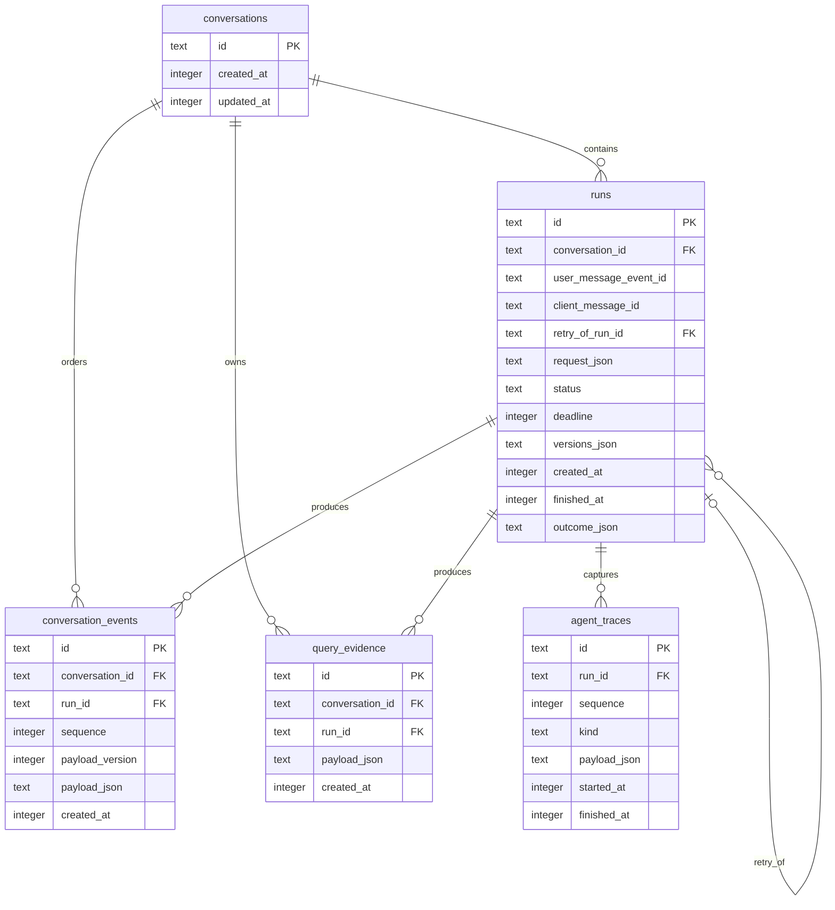
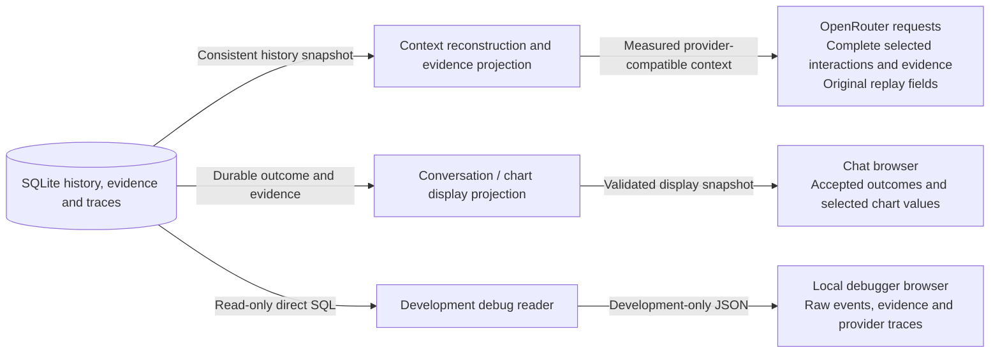
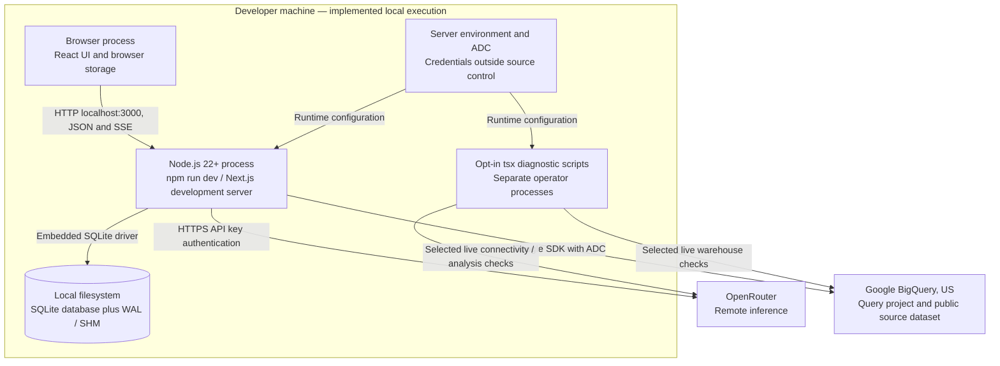
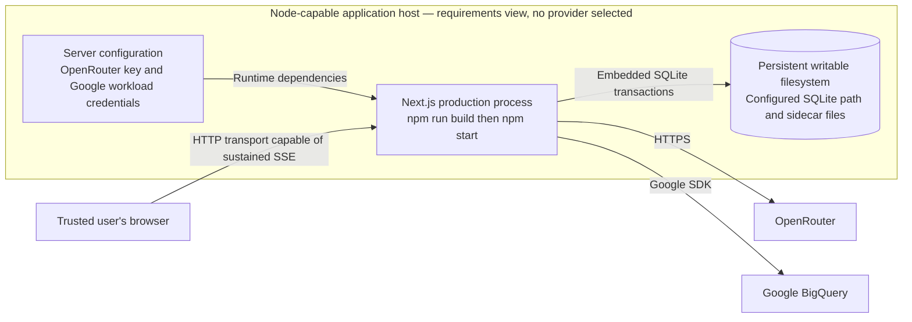

# Data and deployment

## Persistent model

The diagram shows declared foreign keys. `runs.user_message_event_id` is an application-validated reference to an event, without a database foreign-key declaration. A retry reuses that original event, potentially from a previous run. Tool-result event payloads refer to evidence by ID; reconstruction validates those JSON references and ownership.

| Record | Content and constraints |
| --- | --- |
| Conversation | Identity and timestamps; sequence ownership for its events. |
| Run | Submission identity, retry link, original user-event reference, absolute deadline, model/prompt/tool/semantic versions, status and accepted outcome. Unique `(conversation_id, client_message_id)` prevents duplicate admission; a partial unique index permits at most one running attempt per conversation. |
| Event | Ordered, versioned JSON user messages, assistant messages, tool results, context notes and terminal outcomes. Unique conversation sequence; assistant records retain provider replay information. |
| Query evidence | Full bounded query result, SQL, statistics, semantic snapshot, declared scope and assumptions. Saved atomically with its paired tool-result checkpoint. |
| Agent trace | Ordered best-effort model/tool diagnostics per run. Model traces can contain exact provider request bodies and raw response bodies; capture may be incomplete. Successful tool traces follow their checkpoint and can be inserted for a terminal run without modifying its accepted outcome. |

The repository uses runtime schemas when decoding persisted records. Foreign keys are enabled; write transactions use immediate locking, and history reads use one deferred transaction for a consistent WAL snapshot. WAL and a 5,000 ms busy timeout are configured. `better-sqlite3` lock waiting is synchronous and may block the Node event loop; the timeout bounds lock waiting rather than complete operation duration.

Schema initialization uses `CREATE ... IF NOT EXISTS`. It neither migrates nor deletes existing records. Opening an incompatible schema fails; there is no versioned migration system, automatic repair, retention policy, or backup workflow implemented in the repo.

## Three different projections

Normal chat does not receive raw provider traces, reasoning, SQL, or arbitrary query columns. Answer metadata and evidence IDs are part of accepted outcomes; chart data is selected from evidence on the server and is display-only, never persisted as another model-history record. Debug inspection deliberately exposes a larger payload through a separate development path. Safe category-based console diagnostics are distinct from persisted raw trace capture.

## Local deployment

Scripts are auxiliary executable entrypoints, not always-running services. `openrouter:check` tests a tool call and continuation with a local result; BigQuery checks and verification run separately. `analyst:check` runs real analytical cases with temporary SQLite. Deterministic tests use fake external collaborators and do not require cloud credentials.

## Production execution requirements

This is a requirements view, not evidence of a deployed environment. The repo has no hosting-provider configuration, container image, infrastructure definition, or CI/CD workflow. Configuration loads on demand, so compilation does not require provider credentials. Production routes require Node; the native SQLite driver and writable durable storage are unsuitable for an Edge-only runtime.

An application host must permit outbound cloud requests and request lifetimes compatible with the run budget and cleanup. Any proxy must support unbuffered SSE. Ephemeral or separate per-instance database files do not provide shared authoritative conversation state; the repository supplies no distributed persistence or execution ownership mechanism. The diagram assumes one application host with durable local SQLite storage. Production mode disables the debugger but does not introduce authentication or authorization, so the current application remains limited to trusted access.

## Configuration and execution limits

| Setting / limit | Default or requirement | Owner |
| --- | --- | --- |
| `OPENROUTER_API_KEY`, `OPENROUTER_MODEL` | Required for analysis; server only | OpenRouter configuration |
| `OPENROUTER_MAX_RESPONSE_BYTES` | 2,097,152 bytes for full UTF-8 response including reasoning | OpenRouter transport |
| Provider request time | Smaller of 60 seconds and remaining run deadline; includes body reading | OpenRouter transport |
| `GOOGLE_CLOUD_PROJECT` | Required query-job project; ADC authenticates Google requests | BigQuery configuration |
| `BIGQUERY_LOCATION` | `US`; other values rejected for this sample | BigQuery configuration |
| `BIGQUERY_MAX_BYTES_BILLED` | `1073741824` bytes (1 GiB) per query; dry-run estimate and execution cap | Query service / BigQuery |
| `SQLITE_DATABASE_PATH` | `.data/hockeystack.sqlite`, resolved to absolute path | Persistence configuration |
| `AGENT_CONTEXT_WINDOW_TOKENS` | 1,000,000 local allowance; verify against selected provider | Context configuration |
| Context reserves | Normally 4,096 output tokens plus 2,048 safety tokens | Request measurer / context budget |
| Run duration / finalization grace | 120,000 ms / 5,000 ms; deadline never renewed by a tool | Conversation service |
| Model calls / output ceiling | Six calls / 4,096 output tokens per call; last call terminal-only | Agent runner |
| SQL attempts / shared result budget | Four attempts / 1 MiB of result JSON per analysis invocation | Analysis execution context |
| Per-query results | 200 rows / 256 KiB UTF-8 columns-and-rows JSON; explicit truncation | Query service |
| Debug trace wait | At most 100 ms or remaining execution time per callback; skipped after cancellation/expiry | Observability |

The fallback context estimator counts one estimated token per UTF-8 byte of the complete encoded provider request. It is conservative, not a provider tokenizer or guaranteed capacity bound. Overflow fails explicitly; history, rows, and reasoning are not silently truncated. BigQuery result-size controls do not cap scan cost. Unsafe-sized integers and exact decimals are represented as strings; temporal values are strings, nested values remain JSON, and nulls remain null.

SQL policy allows a bounded GoogleSQL SELECT subset over fully qualified sample event tables. Each wildcard source requires literal date suffix bounds in its own query scope, within November 2020 through January 2021. Explicit projections are required except permitted aggregate forms such as `COUNT(*)`. Writes, exports, scripts, unknown functions, recursive queries, decorators, and window functions are outside the supported subset; parse failures fail closed. The validated original SQL is executed without rewriting.

There are no automatic application retries. Execution scopes bound the caller's wait and consume late failures; external cancellation and stream disposal are best-effort cleanup. Persisted model replay pins a resolved model and, when known, provider origin; conflicting replay fails before HTTP. If provider identity was absent, exact endpoint routing cannot be guaranteed.

## Source references

[Schema and initialization](../../src/server/adapters/persistence/schema.ts), [SQLite transactions](../../src/server/adapters/persistence/repository.ts), [persistence configuration](../../src/server/config/persistence.ts), [public environment template](../../.env.example), [scripts and runtime](../../package.json), [execution scope](../../src/server/execution/scope.ts), [SQL policy](../../src/server/data/sql-policy.ts), [OpenRouter protocol](../../src/server/adapters/openrouter/protocol.ts), and [context budget](../../src/server/context/budget.ts).
