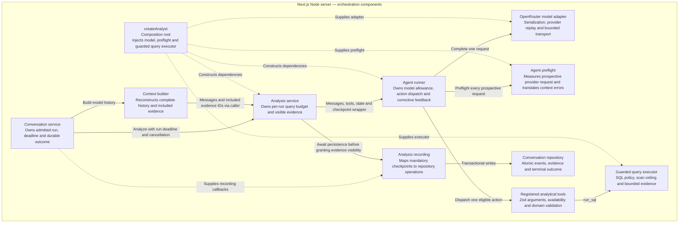
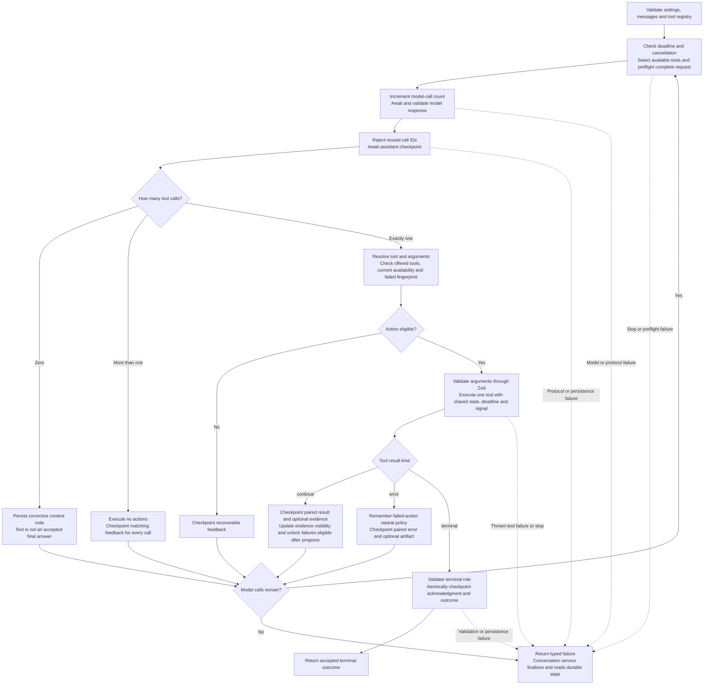

# Agent orchestration

This view expands the analyst components in [C4 level 3](03-components.md) and the contracts in [C4 level 4](04-code.md). It explains how one analytical attempt is assembled and controlled. The broader HTTP, recovery, and query-job sequences remain in [runtime flows](05-runtime-flows.md).

The application uses **one sequential model/tool loop per run**. There is no multi-agent coordinator, delegation, parallel tool execution, agent framework, or background execution queue. The model proposes actions; application code validates, executes, persists, and accepts them.

## Composition and ownership

| Responsibility | Owner |
| --- | --- |
| Run admission, retry identity, absolute deadline, failure finalization and browser snapshot | Conversation service with transactional repository operations |
| Reconstructed history, complete interaction selection, evidence projection and initial request measurement | Context builder |
| Shared SQL budget and evidence that the model actually received | Analysis service, created separately for each invocation |
| Available tool definitions, model-call count, failed-action fingerprints and sequential dispatch | Agent runner |
| Runtime argument validation and advertised JSON schema | Tool registration |
| SQL execution, clarification content, answer provenance and chart validation | Analytical tool handlers |
| Provider-specific messages, replay compatibility, HTTP response validation and transport limits | OpenRouter adapter |
| Event/evidence checkpoint mapping and storage-error translation | Analysis recording callback |

`createAnalyst()` constructs the model adapter, provider request measurer, guarded query executor, and runner, then injects the runner and query executor into the analysis service. Services do not construct vendor SDK clients inside the iteration loop.

For each invocation, the analysis service verifies historical evidence ownership and seeds `visibleEvidence` only from complete evidence payloads included in model context. It creates one shared query execution context and wraps the caller's checkpoint callback. A newly returned query result enters `visibleEvidence` only after its visible-evidence checkpoint succeeds. Merely storing an unavailable result does not grant visibility.

## Decision loop

Any mandatory checkpoint rejection stops execution, including checkpoints in feedback and continuing-result branches. A successful terminal checkpoint is the acceptance point. It remains successful if cancellation or expiry occurs during that write; the browser outcome is subsequently projected from durable state.

The runner keeps a local continuation transcript without modifying the caller's initial messages. Assistant replies are persisted before dispatch, and paired results are persisted before another model request. Tool handlers can call `checkContinuation(content)` to measure the complete prospective request before delivering a result. Oversized query evidence can therefore produce compact corrective feedback plus a persisted unavailable artifact, without silently truncating rows or reasoning.

## Analytical actions and stopping rules

| Tool | Role | Action and acceptance boundary |
| --- | --- | --- |
| `inspect_dataset` | Continuing | Reads the local versioned schema/semantic catalog without a warehouse request. |
| `run_sql` | Continuing | Executes guarded SQL while attempts and result bytes remain. Returns bounded evidence or a typed error. |
| `request_clarification` | Terminal | Saves a validated question and optional choices. A user reply creates a new run. |
| `finish_answer` | Terminal | Requires valid evidence references, analytical findings, completeness/limitations and supported chart specifications before acceptance. |

By default, one run has six model requests with a 4,096-token output ceiling per request. The last request advertises terminal tools only. The shared query budget permits four attempts and 1 MiB of result JSON. The conversation owns a 120-second absolute deadline; model calls and tools do not renew it. See [data and deployment](06-data-and-deployment.md) for transport, scan and per-query limits.

The runner checks tool availability when advertising definitions and again before dispatch. It fingerprints the tool name and canonical arguments, retaining malformed argument strings for deterministic feedback. An `unchanged_arguments` failure remains blocked for that fingerprint throughout the attempt. An `until_progress` failure becomes eligible again only after a successful continuing result is durably checkpointed. Recoverable feedback consumes model capacity but does not automatically re-execute an action. Successful actions may be repeated.

Data answers require visible evidence and evidence-backed findings. Referenced truncated results require partial completeness and explicit limitations. For a diagnostic answer, an unresolved necessary question that can still be investigated blocks early completion while continuation and SQL budgets remain, unless a specific obstacle is declared. These checks validate declared analytical structure and provenance; they do not mechanically prove that SQL or the model's interpretation answers the business question correctly.

## Failure and observability boundaries

Malformed envelopes, repeated call IDs, incompatible replay, context overflow, exhausted allowances, cancellation, deadlines and mandatory persistence failures stop the attempt with typed categories. Unknown tools, malformed arguments, unexpected batches, and recoverable domain errors instead produce paired corrective feedback while model capacity remains. There are no automatic application retries, and interrupted work is not resumed by polling.

Model and tool traces are separate from the analytical checkpoints used for replay and acceptance. Current trace capture is best-effort, with a 100 ms waiting ceiling further bounded by the relevant execution deadline. A trace failure must not replace the model/tool result or undo terminal acceptance. The ceiling bounds asynchronous waiting, not synchronous SQLite lock contention. Raw trace content stays on the server and is exposed through the development debugger, not normal chat events.

## Source references

[Composition](../../src/server/config/analysis.ts), [analysis service](../../src/server/analysis/service.ts), [runner](../../src/server/agent/runner.ts), [action resolution](../../src/server/agent/actions.ts), [tool registration](../../src/server/agent/tool-registration.ts), [analytical tools](../../src/server/analysis/tools.ts), [answer validation](../../src/server/analysis/answer-validation.ts), [checkpoint mapping](../../src/server/conversations/analysis-recording.ts), [preflight translation](../../src/server/config/agent-preflight.ts), and [trace capture](../../src/server/observability/reporting.ts).
