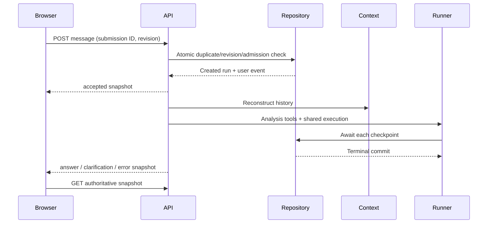

# Conversation service and browser chat

This is the decision record for deliveries 7 and 8. Read it before changing the
workflow. Analytical tools and prompts are supplied by the analysis delivery.

## Ownership and boundaries

Reasoning: persistence and execution already have independent contracts. HTTP
and React must not become workflow engines or sources of analytical history.

Decision: the conversation service owns admission, lifecycle, checkpoints, and
display projection. Context construction reconstructs model history. An injected
analysis service supplies tools and per-run analytical state; its prompt module
supplies versioned instructions. The runner executes one bounded attempt. Configuration constructs these
dependencies. Routes validate inputs and encode responses; browser code reconciles
server snapshots. No framework, dependency container, or secondary agent is added.

The analysis service receives built context, stored evidence, conversation identity,
cancellation and the shared deadline. It owns evidence visibility and query budgets.
Its query_evidence artifacts carry an input and visible/unavailable delivery marker. The conversation service does not interpret SQL or
validate analytical prose.

## Submission identity and revision

Reasoning: a lost response is not proof that execution failed. Repeating a POST
with a fresh identity could perform the same investigation twice. An active-run
lock alone also permits a stale follow-up after another tab finishes.

Decision: every message or explicit retry has a browser-generated UUID
`clientMessageId`. Duplicate lookup compares normalized operation input before
configuration, revision, or active-run checks. Matching input returns the original
run, even after the conversation advances. Different input with the same identity
is a conflict. An explicit retry has a new identity and references the latest
failed, cancelled, or interrupted run; it never adds another user event.

Every new operation includes `expectedRevision`. Revision is `v1:<run count>:<last
event sequence>`, derived in a consistent snapshot and checked inside the admission
write transaction. Run count detects an eventless retry; sequence detects all
checkpoint and outcome writes. Timestamps are neither revision nor ordering keys.
This requires no database migration. A stale tab refreshes and preserves its draft;
the user reviews the new context before submitting with a new identity.

Alternatives: accept unseen latest context, allow historical retries, or use
timestamps as versions. These simplify some requests but make follow-up meaning
or concurrency ambiguous. Exactly-once external I/O is not promised: only one
executor is admitted for a submission; interrupted operations are never resumed.

## Execution, cancellation, and durable outcomes

Reasoning: background execution would need a durable job owner. The local Node
assessment already has request-owned execution and bounded adapters.

Decision: execution belongs to the originating streaming request. Request abort
and response-body cancellation stop it. New conversation aborts the old request
and switches identity without deleting records. A duplicate POST only observes
state; cancelling it cannot cancel the original executor.

The workflow is admission → history/context → analysis state → runner/checkpoints
→ durable outcome → browser notification. One absolute 120-second deadline is
shared with model and query work. Existing six-model/four-query/result budgets
remain. Checkpoints are awaited: assistant before dispatch, evidence and result
together, terminal acknowledgment and outcome together. Successful terminal
persistence is the commit point and survives cancellation during its write.

Failures are finalized before being reported as durable. If finalization conflicts,
read the committed attempt instead. If storage cannot establish an outcome, report
`synchronization_failed`, retain uncertainty, and reconcile; do not invent failure
or success. Expired running attempts become interrupted after a five-second cleanup
grace. Execution still stops at its original deadline. The first terminal database
transaction wins; late work cannot append to ended attempts. GET and admission
reconcile expiry. No automatic retries, background jobs, or crash resumption.

Repository connections open explicitly per request and close after execution and
cleanup settle. Imports and builds never open databases or require credentials.
Progress delivery errors abort the owner and do not bypass persistence cleanup.

## HTTP and display contracts

| Endpoint | Request | Response |
| --- | --- | --- |
| POST /api/conversations | no body | 201 conversation snapshot |
| GET /api/conversations/{id} | UUID path | 200 snapshot after expiry reconciliation |
| POST /api/conversations/{id}/messages | message, clientMessageId, expectedRevision | SSE for a new run; JSON snapshot for a duplicate |
| POST /api/conversations/{id}/runs/{runId}/retry | clientMessageId, expectedRevision | SSE for a new linked run; JSON snapshot for a duplicate |

Runtime schemas validate both requests and browser responses. Messages are trimmed,
nonempty, and at most 2,000 characters. Errors before streaming use JSON: 400 invalid
input, 404 missing resource, 409 stale history/active run/invalid retry/submission
mismatch, 503 unavailable configuration or persistence, 500 unexpected failure.
Errors expose stable categories and safe messages, never raw exceptions. Reads and
streams are not cached. The old browser-authoritative /api/chat path is removed.

Snapshots contain conversation identity, revision, ordered user messages, attempts
with submission/retry identity and lifecycle, and validated terminal outcomes.
Only final answer narratives and clarification questions become analyst messages.
Provider replay, intermediate text, context notes, SQL, raw evidence payloads,
arguments, and internal diagnostics never enter the projection. Answers may also
contain chart specifications; display attempts attach selected chart columns and
rows as `renderedCharts`. This display-only data is derived from saved evidence
and excluded from persistence and model replay. See [answer charts](answer-charts.md)
for validation, limits, rendering and failure behavior. Retries stay attached to one question.

New execution emits `accepted` with a persisted snapshot, coarse `progress`
(`thinking` or `querying`), then one `answer`, `clarification`, or `error` event while
the connection is usable. Terminal events contain an authoritative snapshot.
Disconnected streams cannot guarantee delivery. A synchronization error is explicitly
not a durable failure. Duplicate POSTs return JSON: 202 for running, 200 for terminal.
They do not fabricate terminal events or subscribe to another executor.

SSE decoding supports fragmented UTF-8, LF/CRLF, comments, and multiline data. EOF
without a terminal event means uncertainty. No token streaming or provider reasoning.
Alternatives: JSON-only (less progress), persistent background jobs (more lifecycle
machinery), or EventSource (does not naturally carry a POST body).

## Browser reconciliation and indications

Reasoning: server history is authoritative, but an unaccepted message exists only
in the browser. Per-tab recovery prevents tabs from sharing mutable pending work.

Decision: localStorage retains the last active conversation ID; sessionStorage
retains this tab's active identity and pending operation, including its text and
submission identity. Reload prefers the per-tab identity. Another tab starting a
conversation never switches this tab. Legacy browser transcripts are not imported.
Pending recovery must be saved before submission; storage failure preserves the
draft and blocks that submission with a clear explanation.

On uncertain delivery or reload, GET the snapshot and look up the submission ID.
If present, clear the pending record and observe its existing attempt. If absent,
restore the draft and offer explicit resend with the same ID. If revision changed,
refresh and require a reviewed submission with a new ID. Never resend automatically.
Keep uncertain pending records until acceptance or a definite rejection is known.

Only one poll is in flight. Poll every two seconds while running or uncertain, pause
while hidden/offline, refresh immediately on focus/reconnect, and refresh idle state
on focus. Conversation identity, operation generation, and monotonic revisions reject
late snapshots. New conversation and unmount abort active browser requests.

States are loading, ready, submitting/running, reconnecting, and recoverable error.
Use “Loading conversation…”, “Thinking…”, “Querying data…”, and “Reconnecting…”.
Do not show an execution log. Disable sends while busy or uncertain. Preserve drafts
on refresh/conflict. Use Check status/Resend message for delivery recovery and Retry
analysis only for the latest eligible terminal attempt. Clarification choices and
free text both submit normal messages. Display assumptions, limitations, and a
partial-answer label. New conversation clears its draft, not server history.



```mermaid
sequenceDiagram
  Browser->>API: POST original submission
  Note over Browser,API: Connection lost; acceptance unknown
  Browser->>API: GET conversation on reload
  alt Submission exists
    API-->>Browser: Existing attempt/outcome
    Note over Browser: Poll if still running; never execute twice
  else Submission absent
    API-->>Browser: Current revision
    Note over Browser: Restore draft; explicit resend or review stale context
  end
```

Clarification ends an attempt; its next user message starts a new one with the saved
question/choices in context. Two tabs with the same revision race admission: one
wins and the other refreshes. Explicit retry links an eligible latest attempt and
reuses its question. A process crash leaves running state until expiry reconciliation.

## Context size audit

The local SQLite database inspected on 2026-10-07 contained 21 conversations,
46 runs, 149 events, and 14 evidence records. These are database-wide counts; a
model request loads history for one conversation only. The largest conversation
had 9 assistant messages, all replayed as complete interactions. Its persisted
history and evidence sizes were:

| Component | Stored size | Context contribution |
| --- | ---: | --- |
| Provider `reasoning` | 4.4 KB | Replayed on assistant messages. |
| Provider `reasoning_details` | 28.6 KB | Replayed structured provider data; the database-wide text inside these blocks was only 3.6 KB. |
| Assistant tool calls and arguments | 20.6 KB | Included SQL intent/query arguments and terminal answer arguments. |
| Outcomes | 14.1 KB | Includes saved answers and statuses. Failure outcomes are projected to a short status note. |
| Stored query evidence | 14.8 KB | Includes row results and semantic-guide snapshots; database ownership metadata is not sent. |
| User messages | 443 B | Replayed user history. |
| Tool-result events | 1.4 KB | Result references and acknowledgments; visible evidence payloads are counted separately above. |

Across the entire database, assistant messages held about 124 KB of provider
reasoning fields (20 KB `reasoning` and 104 KB `reasoning_details`) and 36 tool
calls whose arguments totaled about 56 KB: 17 `run_sql`, 18 `finish_answer`, and
one clarification call. These database-wide totals are not sent in one request.
Answer content appears in both the `finish_answer` arguments and the saved
outcome, so it is represented in multiple replay messages.

These figures are persisted UTF-8 payload sizes, not exact model token counts or
an exact measurement of the projected request. Projection changes failure
outcomes, removes database ownership fields from evidence, and adds the fixed
analyst instructions and tool definitions to every request. The current fallback
estimator counts each serialized UTF-8 byte as one estimated input token. In this
snapshot, reasoning replay and tool arguments were the largest history costs;
user messages were small. The snapshot is local and will change as conversations
are added.

## Browser chat layout and controls

The browser chat keeps the header and composer visible within the viewport. The
conversation is the scrollable region between them; new snapshots follow the
latest message only while the reader is already near the bottom. Scrolling up
keeps the current reading position, and changing conversations resets the view.

The message box remains editable while a locally submitted request is running.
The Send control becomes a square stop button that aborts that request. The
browser then reloads the authoritative conversation snapshot before allowing
another submission. The server records cancellation when it has accepted the
request; if completion commits first, the completed answer is retained. Text
typed while waiting is preserved when the submitted message is accepted, when
the answer completes, and when the request is cancelled. A running attempt
restored from server history has no local request to abort, so it remains
read-only for submission until polling observes its terminal state.

## Verification and limits

Fake analysis/model tests and temporary SQLite integration tests cover answers,
clarification/follow-up, duplicates across connections, mismatched identity, stale
revisions, eventless retry, retry eligibility, checkpoints, cancellation, terminal
commit races, failure persistence, expiry, and reopening. Projection tests prove
server protocol fields do not leak. Browser tests cover storage recovery, fragmented
SSE, revision ordering, offline/reload, pending operations, and stale responses.
Run tests, lint, typecheck, and production build. Exercise a browser flow when a
browser harness is available; live analytical evaluation belongs to analysis delivery.

Local single-instance Node with SQLite, no accounts, migrations, token
streaming, compaction, history browser, or background execution. Tools/prompts are
an explicit dependency, composed through createAnalysisService from the parallel
analytical delivery. There is no text-only fallback or fabricated analyst.
